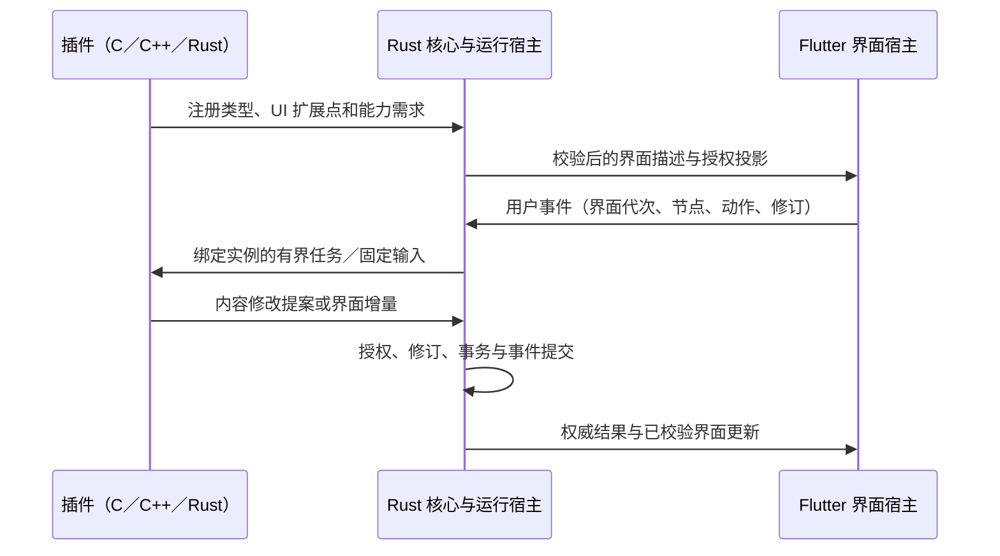

# 插件 SDK 与 UI 对接设计补充

日期：2026-09-11。依据：用户新增 C／C++／Rust 第三方开发支持要求，以及现有全平台架构基线。本文决定开发边界和实施任务；不表示插件执行器、界面渲染器或完整 SDK 已经完成。

首期提供 **C SDK、C++ SDK、Rust SDK**，共用宿主契约与权限语义。暂不提供 TS／JS 插件开发接口。**第三方开发者不必使用 Dart；插件提供声明式界面数据，Flutter 宿主负责渲染。** Dart 保留为宿主和随包组件的开发语言，动态 Dart 插件列为后续研究，不进入 0.2.0 前置条件。

## 1. SDK 的层次与交付

| 层次 | 职责 | 边界 |
| --- | --- | --- |
| 固定契约 | 宿主命令、结果、生命周期、任务、资源、UI 与交互事件 | Cap’n Proto schema、版本及摘要纳入版本控制；预编译生成 |
| C SDK | 最小稳定适配接口、字节视图、长度、状态、显式释放及生成的类型化构造／读取方法 | 不暴露宿主内部 Store、授予权限或自选实例入口；C ABI 只用于本地调用适配 |
| C++ SDK | C 接口上的 RAII、只读消息视图、结果类型、任务取消和 UI 构造器 | STL、异常、虚函数、编译器对象布局不跨公共 ABI |
| Rust SDK | 类型化命令、生命周期、受控资源借用、Result／异步任务及 UI 构造器 | Rust 默认 ABI、所有权对象和引用不跨运行时；unsafe 局限于经过检查的适配边界 |
| 执行后端适配 | 将 SDK 调用绑定到实际实例和通道，提供取消、限额与资源管理 | 原生 IPC／mmap、Wasm 线性内存及浏览器 Worker 分别实现；SDK 不能代替沙箱 |
| 开发工具 | 脚手架、包校验、绑定生成、能力检查、本地测试宿主、故障注入及调试 UI | 工具输出可读视图；正式配置及锁定结果仍为 Protobuf＋LZ4 |

三种语言使用相同的测试向量和错误语义，不分别维护三套权限或事务规则。公共接口按用途分层：content、workspace、draft、resources、tasks、dependencies、diagnostics、ui。业务类型与界面元素采用显式版本化注册，SDK 版本与宿主协议兼容表共同发布。

C 开发者不应长期手写 Cap’n Proto 指针与布局；类型化辅助函数须由固定 schema 或共享协议实现生成。C++ 可使用生成的 C++ 绑定配合便捷层，Rust 使用生成的 Rust 绑定。共享 C ABI 与 Wasm imports／组件导入不是同一回事；不得把本机函数指针、结构体内存布局或 usize 直接搬进线性内存或跨进程传输。

Wasm 是首要候选格式，执行后端继续按平台验证。C／C++ 与 Rust 的 Component Model 绑定已有官方工具路径，但是否采用 WIT／组件模型仍取决于平台探针。即使采用，WIT 也只描述装载和资源承载接口，业务运行期契约仍为 Cap’n Proto，不另建一套平行业务协议。[C／C++ 组件绑定](https://component-model.bytecodealliance.org/language-support/building-a-simple-component/c.html)、[语言支持](https://component-model.bytecodealliance.org/language-support.html)。

## 2. 插件开发流程

1. 创建 C、C++ 或 Rust 项目，声明插件 ID、版本、内容类型、接口、依赖和申请的能力。
2. 使用固定 SDK 生成命令与结果绑定；声明 UI 扩展点和所需控件能力。
3. 用本地测试宿主处理合成卡片、草稿及附件，运行缺权限、撤权、修订冲突、取消和重启测试。
4. 编译为目标后端接受的模块；打包程序、版本化 manifest、schema 摘要、依赖锁定和资源。
5. 包校验工具检查入口、导入、资源限额、格式及摘要；运行时由宿主决定实际授权，不把清单当成已授予权限。
6. 通过各声明平台的执行、故障、UI 与恢复资格后，才把该平台标为支持。

正式 manifest 与依赖锁定采用 Protobuf＋LZ4，便于编写的配置只作为开发工具输入或派生视图。签名、信任和撤销策略在 M3／M4 中实施；目前不得给未建立的包签名机制虚设“已验证”标志。

C／C++ 的异常、longjmp 或 Rust panic 不能跨宿主适配边界。运行时必须能终止死循环和失控模块，不能依赖插件遵守 SDK。原生独立进程本身也不是完整权限沙箱；原生后端必须额外证明 OS 资源访问限制。未经隔离的第三方动态库不能直接装入 Flutter 或可信核心进程。

## 3. 插件与 UI 的对接

### 3.1 三种能力层次

| 层次 | 插件提供 | 宿主负责 | 首期范围 |
| --- | --- | --- | --- |
| 内容与动作 | 类型描述、摘要、字段、编辑命令、预览 | 通用卡片、菜单、属性页与默认编辑 | 必需；插件失效后仍可展示已保存摘要／预览 |
| 声明式界面 | 受限组件树、绑定、操作 ID、验证规则、增量更新 | Flutter 控件、布局、输入法、焦点、无障碍、主题与生命周期 | 首期主要交互方式 |
| 专业渲染 | 受控绘制列表或不可变图像／纹理资源引用及输入事件 | 合成、裁剪、命中区域、帧预算、资源租约和能力检查 | 后续能力；不直接嵌入任意 Widget／原生窗口／WebView |

首批 UI 扩展点：卡片预览、卡片编辑区、侧边面板、属性／设置分组、工具栏及上下文操作。首批组件采用有限集合：行列与分组、文本／Markdown、按钮、输入框、开关、选择器、列表与表格、进度与状态，以及宿主已有的附件预览。高级编辑器通过版本化能力扩展，不把整个 Flutter Widget API 公开给插件。

每个节点具备稳定 node_id；界面实例由宿主分配 view_instance 和 generation，更新携带基准树修订。未知必需节点拒绝并显示可用退化内容；可选节点可使用明确的 fallback。尺寸、节点数量、层级、字符串、更新频率和资源引用均设上限，先用原型测量再确定发行参数。

插件可以使用主题角色，例如正文、次级文本、强调色、边框和表面；宿主统一映射主题色罗盘、深浅色、玻璃材质与动态效果。专业内容自身颜色通过有界调色参数表达，不能用任意样式覆盖其他界面。宿主处理窄屏导航、侧栏过渡和减少动效偏好。

### 3.2 事件与状态的流转

界面描述与事件通过 Cap’n Proto 传递；不能以 JS、Dart 源码、任意表达式或字符串 eval 承载逻辑。调用者身份来自宿主通道；插件给出的动作 ID 不自动产生写入、网络或文件权限。点击按钮也必须经过同样的核心提交与审计路径，官方插件不例外。

| 状态 | 权威位置 |
| --- | --- |
| 焦点、光标、选区、滚动、动画与临时布局 | Flutter 界面宿主 |
| 正式卡片、工作区、视图状态、持久草稿 | Rust 内容核心，Protobuf＋LZ4 |
| 插件任务、计算中间状态、服务依赖 | 运行宿主管理；需要恢复时按持久化规则保存 |
| 当前组件树、增量事件 | 运行期 Cap’n Proto；若需缓存，使用独立持久契约 |
| 共享图像、附件与专业渲染资源 | 核心资源管理与有界租约，原始载荷保持原字节 |

输入、光标移动和滚动不应逐帧跨语言往返。宿主即时更新编辑状态，在规定保存策略下将草稿交给核心；插件可异步验证与计算，但不能让持久草稿仅存在插件内存或退出回调中。列表按需获取，摘要／缓存预览不要求启动插件。

界面关闭或授权撤销后，旧 generation 的更新丢弃；释放视图租约不误停其他消费者共享的服务。插件无响应时保留核心已有草稿、只读预览与明确的恢复入口。已有内容和未知字段不随插件卸载删除。

### 3.3 UI 验收门槛

- 同一个示例界面分别由 C、C++、Rust 插件生成，宿主渲染和操作结果一致。
- 主题色罗盘、深浅色、玻璃材质、窄屏、键盘／输入法、读屏与减少动效适配通过。
- 伪造节点、跨视图更新、过期代次、越权动作、超大树、更新洪泛与失控渲染不会绕过核心。
- 未知可选组件可退化；缺少必需能力明确报告。插件失效后仍可读取摘要、恢复草稿及导出已有原件。
- 性能测试覆盖整条交互链与可见内容规模；编码吞吐量不能代替输入延迟或帧率证据。

## 4. 是否需要 Dart 插件

**首期不需要把 Dart 作为第三方动态插件语言。** 界面由 Flutter 渲染，不意味着插件必须返回 Dart Widget；声明式描述与动作协议可以让三种首期语言共享界面能力。

Dart 仍有两个必要用途：Flutter 宿主实现，以及随应用编译的受审核界面／平台适配包。Flutter 官方插件开发模式组织平台能力和 app-facing package，不能自动等同于 Morrow 的独立安装与隔离插件。[Flutter 插件开发](https://docs.flutter.dev/packages-and-plugins/developing-packages)。

Flutter 的 deferred components 主要解决既有应用内容的延迟交付，也不能直接证明任意第三方 Dart 插件可以独立升级并在六个平台安全运行。[Deferred components](https://docs.flutter.dev/perf/deferred-components)。

不能把“Dart 永远不能动态加载”当作结论：Dart 3.13 官方说明已经开展动态模块链接实验。Dart→Wasm 的官方目标也存在，但当前文档面向 Web；这不直接证明它符合 Morrow 选定的 Wasm guest ABI、资源隔离或全平台分发要求。[Dart 3.13](https://dart.dev/blog/announcing-dart-3-13)、[Dart Wasm](https://dart.dev/web/wasm)。本项目现有工具链仍按当前锁定版本验证，不因这份设计自动升级。

将来只有在以下证据齐备时才考虑 Dart guest SDK：执行后端和依赖可控、宿主 API 无旁路、取消／限额／隔离合格、安装升级与跨平台分发可验收，并且提供的能力不能由现有声明式 UI 合理覆盖。届时它与 C／C++／Rust 遵守同样契约，不能拥有直接改 Store 或遍历全部 Widget 树的特权。

## 5. 当前代码与下一步

已添加 sdk/c、sdk/cpp、sdk/rust 的实验传输层和四类内容命令的类型化编解码。C 提供传输静态库与由 Rust 实现的独立编解码动态库；C++17 提供拥有请求／响应的 C ABI 包装；Rust 提供依赖固定 Cap’n Proto 绑定的独立 crate。它们复制请求、提交前准备有界输出、区分传输失败与业务响应且不自动重试。没有导出创建宿主、授予权限、打开数据库或自选插件身份的接口。

当前可直接构造重命名、摘要查询、操作结果查询和附件片段请求，并校验响应契约及关联。SDK 仍缺通用记录／UI 的完整类型化 API、完整附件装配验证、多实例持久任务、mmap 租约、完整包管理及三语言生产执行后端适配。已增加 C／C++／Rust guest 导入和 Windows Wasmi 执行原型，三种语言共享编解码及授权链路，验证权限绑定、限额和提交后故障；证据见 [执行后端说明](../plugin_runtime/README.md)。mp_host_v1／HostV1 只是实验适配接口，既不是稳定插件 ABI，也不是跨进程传输格式。原生指针只在测试适配器本地使用。

实际证据和复现见 [SDK 说明](../sdk/README.md)。C／C++ 和 Rust 的原生编译、传输一致性测试不能代替真实第三方插件执行、Wasm 运行、UI 对接或全平台验收。

任务纳入 M1-05（契约与 SDK）、M3-06（执行后端接入）、M6-06（声明式 UI）与 M6-07（专业渲染／Dart 可行性）。现有记录授权、分页和草稿发布任务继续保留。首轮最终门槛仍是 M5 全链验证，不用 SDK 目录或样例编译替代。

实验包已补充统一打包、校验、不可变安装与包绑定执行，见 [插件包与开发流程](PLUGIN_PACKAGE.md)。这只是包加载原型；签名、依赖、启用／更新状态和 UI 构造器仍待实现。

原生后台队列与取消／排空已有可运行增量，见 [任务接口](PLUGIN_TASKS.md)。目前由可信 Rust 宿主使用，已接入三语言统一任务输入契约，仍缺 Flutter UI 事件桥接，不能把后台示例当作 UI 对接完成。

动态内容命令任务及 C／C++／Rust 输入／完成 API 已建立，见 [任务契约](PLUGIN_TASK_PROTOCOL.md)。纯转换输入与输出已接通；正式 handler 注册、修改提案及声明式 UI schema、渲染器和事件桥接仍未完成，首期语言边界保持不变。
