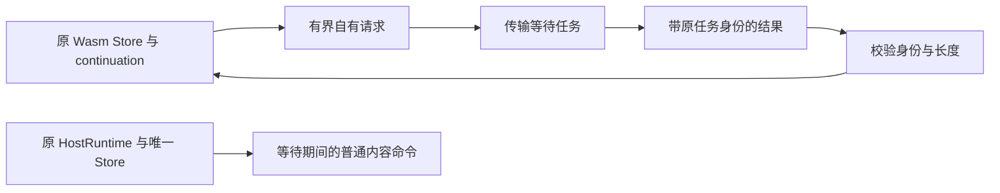

# 可暂停 IO S0：continuation 可行性

2026-09-21；基线 `1c07dc2`，生产版本仍为 `0.1.9-test.52+56`。本轮新增隔离执行探针与方案记录，不改变生产 Runner、公开 ABI、SDK 或已发布包。

## 结论与选择

本机固定依赖 wasmi 1.1.0 的 `TypedFunc::call_resumable` 和 `TypedResumableCallHostTrap::resume` 能保留同一次调用的执行栈、局部变量、全局变量与线性内存。**下一实现优先采用 continuation，暂不要求第三方插件手写 yield 状态机，也不先冻结一套新的 guest ABI。**

这只证明执行机制可行。生产 Runner 目前仍同步执行；新探针没有 Morrow Manager／IoBinding／Broker 的真实准入和证据提交接线，不能用于加载用户插件。

## 当前借用与原型所有权

生产 `plugin_runtime/src/lib.rs` 中 `State<'a>` 持有 `Exchange<'a>`、dependency／IO 回调和借用的输入。`io_jobs::RouteContext` 还借用原 HostRuntime、实例、broker、任务额度和取消状态。仅把现有 `func.call` 换成 `call_resumable`，这些借用不会自动消失，普通拥有者命令仍不能安全取得原宿主的可变访问。

探针 `plugin_runtime/tests/suspendable_probe.rs` 改用只包含有界请求字节、计数、限额的 owned Data。受控 import 校验输入／输出内存范围，复制请求后返回专用 host yield；外层保存同一个 Store、Memory 和不可复制的 continuation，实际等待任务只接收自有请求字节。



没有 HostRuntime/Store 指针、借用闭包或可变引用进入传输线程，也没有新增 unsafe。这里的 session/sequence 只是原型的结果关联标识，不是生产授权凭据。

## 实测

六个测试入口全部通过，0 skipped／ignored：

1. 两次 yield：请求分别为 first、second，返回 7、13 后最终得到 61。局部 seed=41、内存标记=99、入口计数=1 均保持，排除重跑入口替代恢复。
2. 外来任务、旧序号和超长结果被拒绝，既不消费当前暂停状态，也不重置 fuel；之后仍能用正确结果恢复。
3. 取消丢弃 continuation，迟到结果不能恢复；第二次 import 没有执行。
4. 调用额度和 fuel 跨恢复累计，耗尽后终止，不自动补给或重试。
5. 负地址、越界、超长请求、普通 trap 和 start section 不被错误接受为 yield。
6. 实际回环 TCP 传输在门闩后等待，原 HostRuntime 在同一线程上经 `create_local` 完成真实卡片事务；随后恢复原 guest，最后关闭并重开同一库验证内容。没有第二个并发 Store，没有靠时间猜测传输已开始。

wasmi 按基本块批量计费，因此恢复点处 fuel 不必严格下降；验收要求不增加、不重置，并由实际耗尽用例补证。TCP 夹具显式配置 Windows 已接受连接的阻塞模式和读写超时，所有等待有界。

这是原型自己的 TCP 传输和真实 core 内容事务，不是受管 HTTP/TLS、生产 WorkbenchState 命令队列、系统输入或跨平台验收。

## 命令与证据

```powershell
cargo test --manifest-path plugin_runtime/Cargo.toml --target-dir ../integrate-track-a/build/io-codec --features packages --test suspendable_probe
cargo clippy --manifest-path plugin_runtime/Cargo.toml --target-dir ../integrate-track-a/build/io-codec --features packages --test suspendable_probe -- -D warnings
rustfmt --edition 2024 --check plugin_runtime/tests/suspendable_probe.rs
```

测试 **6 项通过**，严格 Clippy 通过。日志 `build/suspendable-s0-test.log` 与 `build/suspendable-s0-clippy.log`；没有重新累计上一轮测试或重建生产产物。

SubagentBridge 的 `glm-5.3-flash / max` 生成了 WAT 主体，任务 `task_7ebb95920b2e8c06d1cc4272`，插件记账输入 279、输出 473 tokens。主代理补上遗漏的 global export，编写恢复适配器和真实宿主测试并审核验证。旧执行授权过期后，按既有授权通过本地官方 CLI 新建并加载有界授权，没有购买供应商配额或改变旧使用记录。

## 接下来的代码

把 owned 执行状态引入独立受控的 Runner 路径，再拆分 broker 的准备／唯一认领、传输等待、原件提交与最终交付。生产恢复还须复核原实例代次、真实授权、累计资源额度、截止与持久 Unknown；这些门槛未由本探针覆盖。

旧 `morrow_io_v1.call` 保持原样；continuation 能否透明承载旧语义必须通过真实包与旧包兼容验收后才可启用。只有确实需要 guest 可见语义变化时才制定独立版本契约。三语言 SDK 仍不具备可冻结的新 IO 稳定面。
